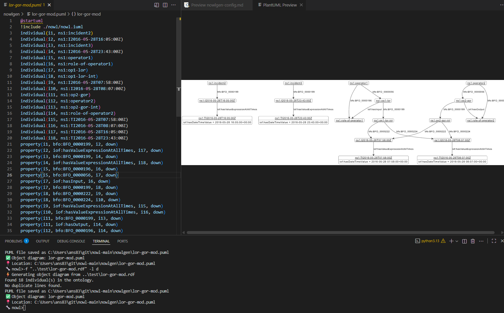
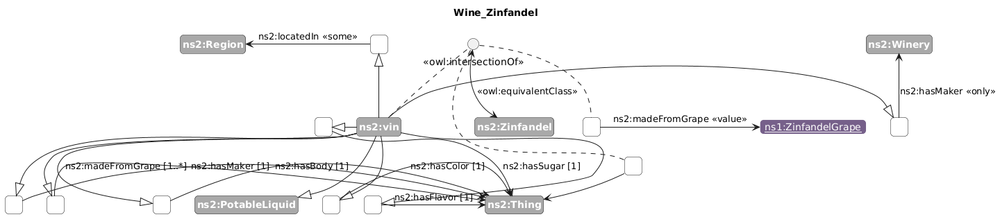
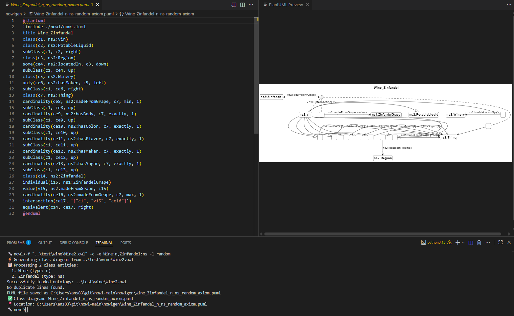

# Tutorial on automatic generation of NOWL diagrams

## Basic operations:

Generate an object diagram. But without filters some object diagrams, especially a knowledge graph, that cannot be processed. (Filters: TBD). 

```
🔧 nowl>-f "..\test\lor-gor-mod.rdf" -l d
⚡ Generating object diagram from ..\test\lor-gor-mod.rdf
Found 18 individual(s) in the ontology.
No duplicate lines found.
PUML file saved as C:\Users\ans83\git\nowl-main\nowlgen\lor-gor-mod.puml
✅ Object diagram: lor-gor-mod.puml
📍 Location: C:\Users\ans83\git\nowl-main\nowlgen\lor-gor-mod.puml
```

With proper layout, small and intuitive models are renderned in a good diagram. 



Generate some class diagrams.

```
🔧 nowl>-f "..\test\wine\Wine2.owl" -c -e http://www.w3.org/TR/2003/PR-owl-guide-20031209/wine#WineDescriptor:ns
⚡ Generating class diagram from ..\test\wine\Wine2.owl
📋 Processing 1 class entities:
  1. http://www.w3.org/TR/2003/PR-owl-guide-20031209/wine#WineDescriptor (type: ns)
Successfully loaded ontology: ..\test\wine\Wine2.owl
No duplicate lines found.
PUML file saved as C:\Users\ans83\git\nowl-main\nowlgen\WineDescriptor_ns_axiom.puml
✅ Class diagram: WineDescriptor_ns_axiom.puml
📍 Location: C:\Users\ans83\git\nowl-main\nowlgen\WineDescriptor_ns_axiom.puml
```

Generate the visualization of a complete definition of a class.

```
🔧 nowl>-f "..\test\wine\Wine2.owl" -c -e http://www.w3.org/TR/2003/PR-owl-guide-20031209/wine#Pauillac:ns,http://www.w3
.org/TR/2003/PR-owl-guide-20031209/wine#Pauillac:n                                                                      ⚡ Generating class diagram from ..\test\wine\Wine2.owl
📋 Processing 2 class entities:
  1. http://www.w3.org/TR/2003/PR-owl-guide-20031209/wine#Pauillac (type: ns)
  2. http://www.w3.org/TR/2003/PR-owl-guide-20031209/wine#Pauillac (type: n)
Successfully loaded ontology: ..\test\wine\Wine2.owl
No duplicate lines found.
PUML file saved as C:\Users\ans83\git\nowl-main\nowlgen\Pauillac_Pauillac_n_ns_axiom.puml
✅ Class diagram: Pauillac_Pauillac_n_ns_axiom.puml
📍 Location: C:\Users\ans83\git\nowl-main\nowlgen\Pauillac_Pauillac_n_ns_axiom.puml
```

Generate diagrams with multiple class axioms forming more complete model. Also, it is not necessary to use the complete IRI!

```
🔧 nowl>-f "..\test\wine\Wine2.owl" -c -e Wine:n,Zinfandel:ns
📋 Processing 2 class entities:
  1. Wine (type: n)
  2. Zinfandel (type: ns)
Successfully loaded ontology: ..\test\wine\Wine2.owl
No duplicate lines found.
PUML file saved as C:\Users\ans83\git\nowl-main\nowlgen\Wine_Zinfandel_n_ns_axiom.puml
✅ Class diagram: Wine_Zinfandel_n_ns_axiom.puml
📍 Location: C:\Users\ans83\git\nowl-main\nowlgen\Wine_Zinfandel_n_ns_axiom.puml
```

You can just generate the class hierarchy. The class should be the root class of the taxonomy you want to create.

```
🔧 nowl>-f "..\test\wine\Wine2.owl" -c -e http://www.w3.org/TR/2003/PR-owl-guide-20031209/wine#WineDescriptor:t
⚡ Generating class diagram from ..\test\wine\Wine2.owl
📋 Processing 1 class entities:
  1. http://www.w3.org/TR/2003/PR-owl-guide-20031209/wine#WineDescriptor (type: t)
Successfully loaded ontology: ..\test\wine\Wine2.owl
No duplicate lines found.
PUML file saved as C:\Users\ans83\git\nowl-main\nowlgen\WineDescriptor_t_axiom.puml
✅ Class diagram: WineDescriptor_t_axiom.puml
📍 Location: C:\Users\ans83\git\nowl-main\nowlgen\WineDescriptor_t_axiom.puml
```


## How to import local ontology files?

If the imported ontology IRI is not resolvable, the following error is thrown.

```
🔧 nowl>-f "..\test\import\complex-import-local.rdf"
⚡ Generating object diagram from ..\test\import\complex-import-local.rdf
❌ Error: Unexpected error during RDF conversion: Cannot download 'http://nist.gov/nowl/benchmark-simple/'!
```

In this case, additional ontologies can be loaded from local path along with the ontology file. The ontologies need to be imported in the same order the ontologies import each other.


```
🔧 nowl>-f "..\test\import\complex-import-local.rdf" -i "..\test\import\benchmark-core.rdf" -i "..\test\import\benchmark-simple-local.rdf"
⚡ Generating object diagram from ..\test\import\complex-import-local.rdf
Loading ontology: ..\test\import\benchmark-simple-local.rdf
Found 2 individual(s) in the ontology.
WARNING: All nodes were filtered out! This suggests a problem with relationship processing.
✅ Object diagram: s
📍 Location: s
```

## How to configure custom NOWL profile path

Use the config command to view and edit the NOWL profile to include. This is useful to test a new profile profile than the default profiles already hosted, or simply refer a local profile file.

```
🔧 nowl>config

📁 Current NOWL include path: ./nowl/nowl.iuml

💡 This path is added to all generated PUML files as:
   !include ./nowl/nowl.iuml

Common paths:
  ./nowl/nowl.iuml          # Default (local nowl folder)
  /path/to/nowl/nowl.iuml   # Absolute path
  ../shared/nowl.iuml       # Relative path
  none                      # No include statement

Enter new include path (or press Enter to keep current): nowl\profiles\iof.iuml
✅ Include path updated to: nowl\profiles\iof.iuml
```

### How to apply layout algorithms to the diagrams to oriend nodes and edges automatically?

We generated `Wine_Zinfandel_n_ns_axiom.puml` but the diagram is not displayed correctly with overlapping nodes, edges and properties. It can be manually updated to layout different commands. However, we can try some layouting algorithm.


Testing with `spring` layout did not produce good result. We can try other layout options (see [readme](README.md)).
```
🔧 nowl>-f "..\test\wine\Wine2.owl" -c -e Wine:n,Zinfandel:ns -l spring
📋 Processing 2 class entities:
  1. Wine (type: n)
  2. Zinfandel (type: ns)
Successfully loaded ontology: ..\test\wine\Wine2.owl
No duplicate lines found.
PUML file saved as C:\Users\ans83\git\nowl-main\nowlgen\Wine_Zinfandel_n_ns_spring_axiom.puml
✅ Class diagram: Wine_Zinfandel_n_ns_spring_axiom.puml
📍 Location: C:\Users\ans83\git\nowl-main\nowlgen\Wine_Zinfandel_n_ns_spring_axiom.puml
```


Using `random` layout is a quick way to find a good layout, e.g., the following screenshot shows how diagrams with different layouts can be geenrated quickly by repeatedly generating the same diagram which then automatically renders in the vs code PlantUML preview.



